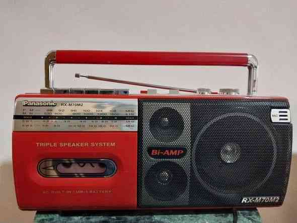
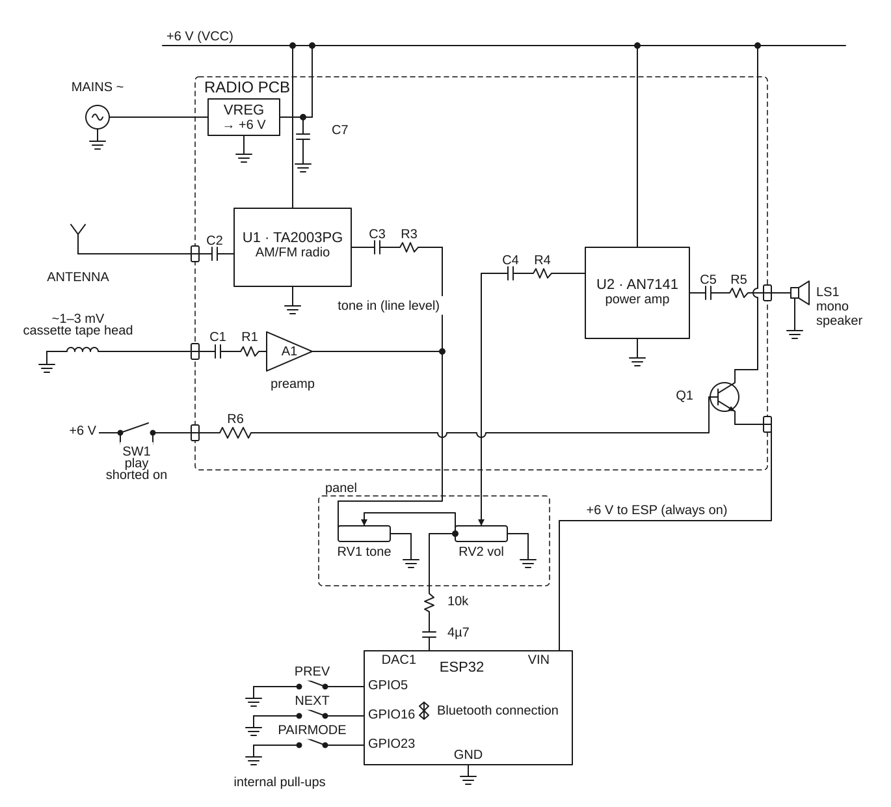

# Panasonic RX-M70M2 Bluetooth Speaker

ESP32 firmware that turns a Panasonic RX-M70M2 cassette player/radio into a Bluetooth A2DP speaker, outputting audio through the radio's existing speaker via the ESP32's onboard DAC.



More detail in the [build blog post](https://www.yusufhussein.com/blog/making-a-cassette-player-into-a-bluetooth-speaker).

---

## Hardware

### Components

- Original ESP32 dev board (onboard DAC required — modules without DAC won't work)
- 6 momentary push buttons (active-low, pulled up internally)
- 10kΩ resistor + coupling capacitor on the DAC output line
- Wires, protoboard

### Wiring

| GPIO | Function       | Notes                          |
|------|----------------|--------------------------------|
| 25   | Audio output   | ESP32 onboard DAC, fixed pin   |
| 2    | Play / Pause   | Active-low button              |
| 16   | Next track     | Active-low button              |
| 5    | Previous track | Active-low button              |
| 14   | Volume up      | Active-low button              |
| 13   | Volume down    | Active-low button              |
| 23   | Pair / unpair  | Clears NVS, enters pairing     |

The DAC output is injected at the input of the radio's volume potentiometer rail (not the cassette input). A 10kΩ resistor and coupling capacitor on the signal line prevent the radio circuit from backfeeding noise into the DAC.



---

## Software

### Build system

PlatformIO with the **ESP-IDF** framework (not Arduino). See `platformio.ini` for board and partition config.

### Modules

| Module | File(s) | Responsibility |
|--------|---------|----------------|
| `bt_audio` | `src/bt_audio.cpp`, `include/bt_audio.h` | A2DP sink, GatedStream mux, playback/volume/pairing API |
| `audio_notify` | `src/audio_notify.cpp`, `include/audio_notify.h` | MP3 notification sounds (connect, disconnect, pair) via FreeRTOS queue + Helix decoder |
| `buttons` | `src/buttons.cpp`, `include/buttons.h` | GPIO ISR + 50ms debounce task, dispatches to `bt_audio` API |
| `app_config.h` | `include/app_config.h` | All compile-time config: pins, BT settings, debug flags |
| `sounds.h` | `assets/sounds.h` | Embedded MP3 clips (hex arrays) |

### Audio path

```
Bluetooth source
      │  A2DP stream
      ▼
BluetoothA2DPSink
      │
      ▼
GatedStream  ◄── muted by audio_notify_task during notification playback
      │
      ▼
AnalogAudioStream (DAC, GPIO 25, 44.1 kHz, mono downmix)
      │
      ▼
Radio speaker

Parallel: audio_notify_task decodes MP3 → writes to DAC while A2DP is muted
```

### Dependencies

- [ESP32-A2DP](https://github.com/pschatzmann/ESP32-A2DP) — Bluetooth A2DP sink
- [arduino-audio-tools](https://github.com/pschatzmann/arduino-audio-tools) — stream-based audio processing
- [arduino-libhelix](https://github.com/pschatzmann/arduino-libhelix) — Helix MP3 decoder

---

## Building & Flashing

```sh
# Build
pio run

# Flash (set upload_port in platformio.ini or via env var)
pio run --target upload

# Serial monitor
pio device monitor
```

### Configuration

All tunables are in `include/app_config.h`: GPIO pins, Bluetooth device name, reconnect count, and debug flags (`DEBUG_NO_CONTROL_AUDIO`, `DEBUG_PLAY_PAIR_AUDIO_ON_STARTUP`).

---

## Demo

[Watch the final build](docs/images/final-product.mp4)
